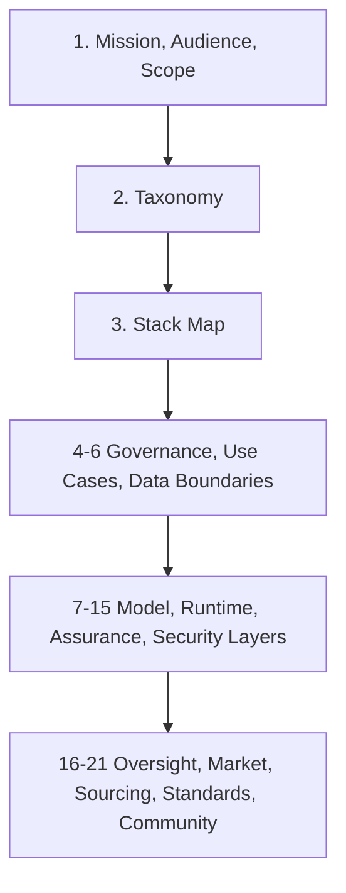

# Open Applied AI Atlas

Open Applied AI Atlas is an open knowledge base for applying AI and ML in business, enterprise, public, nonprofit, and other organizational contexts of all sizes. It is practical, taxonomy-driven, comparison-oriented, and implementation-focused. It is explicitly not limited to LLMs.

## Mission

The atlas exists to help organizations make better applied AI decisions across architecture, delivery, governance, sourcing, and operations. It treats AI systems as organizational systems rather than as isolated model demos, and it keeps open knowledge, sovereignty, portability, privacy, compliance, and lock-in visible throughout the stack.

## Who It Serves

The atlas is written for cross-functional implementers, reviewers, and decision-makers:

- Product, project, and business roles: product managers, project managers, business analysts, domain experts.
- Architecture and engineering roles: enterprise architects, AI architects, software architects, developers.
- ML, data, and platform roles: ML engineers, data engineers, platform engineers.
- Assurance and control roles: QA and test engineers, security professionals, privacy professionals, governance, risk, and compliance professionals.
- Operations, sourcing, and leadership roles: IT operations, platform operations, procurement and sourcing roles, technical leadership, and organizational decision-makers.

## What It Covers

The atlas covers broader applied organizational AI and ML, including:

- chat systems, copilots, coding assistants, coding agents, and workflow agents
- document intelligence, retrieval systems, and memory systems
- forecasting, recommender systems, anomaly detection, and optimization systems
- computer vision, speech systems, classical ML, and deep learning
- generative AI, hybrid systems, fine-tuning, and training systems

## What It Prioritizes

Across those system types, the atlas keeps the same recurring concerns in view:

- open knowledge, open source, open governance, open tooling, open standards, and open research
- practical implementation guidance rather than abstract principle statements alone
- comparison through shared taxonomy, selected tables, and explicit trade-off framing
- direct treatment of sovereignty, portability, privacy, vendor lock-in, and buy-vs-build choices
- compliance-aware implementation, especially where EU AI Act, EU Data Act, GDPR, ISO/IEC 42001, ISO/IEC 23894, and NIST AI RMF shape design and operating obligations

## How To Use The Atlas

Start with the mission and decision spine, then move sideways into the layers that match your role and problem.

The default decision spine is:

1. mission, scope, and audience
2. canonical taxonomy
3. stack and layer boundaries
4. governance and organizational use cases
5. data, model, runtime, and control layers
6. evaluation, observability, security, oversight, sourcing, and ecosystem context

### Role-Based Reading Paths

- Product, project, and business readers: start with [1. Scope And Principles](docs/01-scope-and-principles/01-00-00-scope-and-principles.md), [5. Use Cases And Application Landscapes](docs/05-use-cases-and-application-landscapes/05-00-00-use-cases-and-application-landscapes.md), and [18. Build Vs Buy Vs Hybrid](docs/18-build-vs-buy-vs-hybrid/18-00-00-build-vs-buy-vs-hybrid.md).
- Architecture and engineering readers: start with [2. Taxonomy](docs/02-taxonomy/02-00-00-taxonomy.md), [3. Enterprise AI Stack Map](docs/03-enterprise-ai-stack-map/03-00-00-enterprise-ai-stack-map.md), and the relevant runtime chapters `7` through `15`.
- Governance, privacy, security, and assurance readers: start with [4. Governance Risk Compliance](docs/04-governance-risk-compliance/04-00-00-governance-risk-compliance.md), [6. Data Sovereignty And Privacy](docs/06-data-sovereignty-and-privacy/06-00-00-data-sovereignty-and-privacy.md), [13. Evaluation Testing And QA](docs/13-evaluation-testing-and-qa/13-00-00-evaluation-testing-and-qa.md), [15. Security And Abuse Resistance](docs/15-security-and-abuse-resistance/15-00-00-security-and-abuse-resistance.md), and [20. Standards Frameworks And Bodies Of Knowledge](docs/20-standards-frameworks-and-bodies-of-knowledge/20-00-00-standards-frameworks-and-bodies-of-knowledge.md).
- Operations, sourcing, and leadership readers: start with [16. Human Oversight And Operating Model](docs/16-human-oversight-and-operating-model/16-00-00-human-oversight-and-operating-model.md), [17. Vendors Organizations And Market Structure](docs/17-vendors-organizations-and-market-structure/17-00-00-vendors-organizations-and-market-structure.md), [18. Build Vs Buy Vs Hybrid](docs/18-build-vs-buy-vs-hybrid/18-00-00-build-vs-buy-vs-hybrid.md), and [19. Reference Architectures](docs/19-reference-architectures/19-00-00-reference-architectures.md).

## Chapter Index

- [1. Scope And Principles](docs/01-scope-and-principles/01-00-00-scope-and-principles.md)
- [2. Taxonomy](docs/02-taxonomy/02-00-00-taxonomy.md)
- [3. Enterprise AI Stack Map](docs/03-enterprise-ai-stack-map/03-00-00-enterprise-ai-stack-map.md)
- [4. Governance Risk Compliance](docs/04-governance-risk-compliance/04-00-00-governance-risk-compliance.md)
- [5. Use Cases And Application Landscapes](docs/05-use-cases-and-application-landscapes/05-00-00-use-cases-and-application-landscapes.md)
- [6. Data Sovereignty And Privacy](docs/06-data-sovereignty-and-privacy/06-00-00-data-sovereignty-and-privacy.md)
- [7. Model Ecosystem](docs/07-model-ecosystem/07-00-00-model-ecosystem.md)
- [8. Model Hosting And Inference](docs/08-model-hosting-and-inference/08-00-00-model-hosting-and-inference.md)
- [9. Model Gateways And Access Control](docs/09-model-gateways-and-access-control/09-00-00-model-gateways-and-access-control.md)
- [10. Agentic Systems And Orchestration](docs/10-agentic-systems-and-orchestration/10-00-00-agentic-systems-and-orchestration.md)
- [11. Knowledge Retrieval And Memory](docs/11-knowledge-retrieval-and-memory/11-00-00-knowledge-retrieval-and-memory.md)
- [12. Training Fine-Tuning And Adaptation](docs/12-training-fine-tuning-and-adaptation/12-00-00-training-fine-tuning-and-adaptation.md)
- [13. Evaluation Testing And QA](docs/13-evaluation-testing-and-qa/13-00-00-evaluation-testing-and-qa.md)
- [14. Observability Logging And Monitoring](docs/14-observability-logging-and-monitoring/14-00-00-observability-logging-and-monitoring.md)
- [15. Security And Abuse Resistance](docs/15-security-and-abuse-resistance/15-00-00-security-and-abuse-resistance.md)
- [16. Human Oversight And Operating Model](docs/16-human-oversight-and-operating-model/16-00-00-human-oversight-and-operating-model.md)
- [17. Vendors Organizations And Market Structure](docs/17-vendors-organizations-and-market-structure/17-00-00-vendors-organizations-and-market-structure.md)
- [18. Build Vs Buy Vs Hybrid](docs/18-build-vs-buy-vs-hybrid/18-00-00-build-vs-buy-vs-hybrid.md)
- [19. Reference Architectures](docs/19-reference-architectures/19-00-00-reference-architectures.md)
- [20. Standards Frameworks And Bodies Of Knowledge](docs/20-standards-frameworks-and-bodies-of-knowledge/20-00-00-standards-frameworks-and-bodies-of-knowledge.md)
- [21. Research Open Knowledge And Community](docs/21-research-open-knowledge-and-community/21-00-00-research-open-knowledge-and-community.md)

## Reading Sequence

## Contribution Entry Points

- Read [AGENTS.md](./AGENTS.md) for durable structure and mission guardrails.
- Read [MISSION.md](./MISSION.md) for durable mission, audience, scope, and priorities.
- Read a `pips/PIP_*.md` file only when the task explicitly references it as optional prompt context.
- Read [CONTRIBUTING.md](./CONTRIBUTING.md) for contribution workflow and review expectations.
- Read [EDITORIAL_RULES.md](./EDITORIAL_RULES.md) for numbering, taxonomy reuse, and mission-preserving editorial rules.
- See [CONTRIBUTORS.md](./CONTRIBUTORS.md) for the public contributor list.

## Human-Run Ralph Loop

`./scripts/ralph-codex.py` is a human-run outer controller for long-running Codex work. It launches `codex app-server`, stores structured session state under `.codex/ralph-codex/`, starts in Plan mode to build a broadened execution charter, and resumes prior work only through explicit session commands.

The public CLI is intentionally small:

1. `./scripts/ralph-codex.py`
   Prints help.
2. `./scripts/ralph-codex.py --message "Refactor the controller deeply"`
   Starts a new session from inline message text.
3. `./scripts/ralph-codex.py --file prompts/fix-tests.md`
   Starts a new session from a message file.
4. `./scripts/ralph-codex.py --file prompts/fix-tests.md --profile profiles/cautious.json`
   Starts a new session from a message file with a custom profile.
5. `./scripts/ralph-codex.py --sessions 10`
   Lists the latest ten run-history rows.
6. `./scripts/ralph-codex.py --resume`
   Resumes the latest resumable session.

Canonical schemas for Ralph artifacts live under `schemas/`, the default profile is defined inline in `scripts/ralph-codex.py`, and each persisted JSON or JSONL artifact gets an adjacent copied schema file.

Verification:

- When changing `scripts/ralph-codex.py`, its schemas, or its tests, run `python3 -m py_compile scripts/ralph-codex.py tests/test_ralph_codex.py`.
- Then run `python3 -m unittest discover -s tests`.

## Page Signals

Every page under `docs/` carries a visible metadata line directly under the numbered H1:

- `Page Type`: the page's primary job in the atlas
- `Maturity`: the page's current completeness and trust level

The atlas uses these page types:

- `Chapter Index`
- `Concept Explainer`
- `Comparison Page`
- `Decision Guide`
- `Worked Example`
- `Operational Artifact`
- `Reference Sheet`
- `Glossary`

The atlas uses these maturity levels:

- `Outline`
- `Draft`
- `Review-Ready`
- `Curated Reference`

Use them as navigation aids. Higher maturity pages should anchor stronger decisions, while lower maturity pages should be treated as developing material rather than hidden scaffolding.
