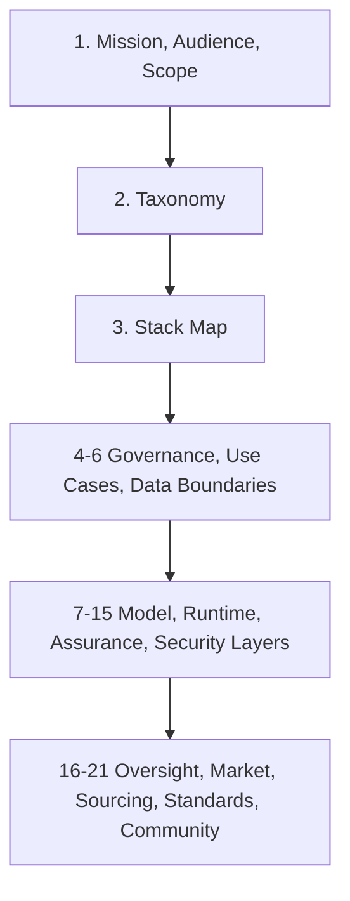

# Open Applied AI Atlas

Open Applied AI Atlas is an open knowledge base for applying AI and ML in business, enterprise, public, nonprofit, and other organizational contexts of all sizes.

## What The Atlas Is

The atlas is practical, taxonomy-driven, comparison-oriented, and implementation-focused. It is designed as a working reference for applied organizational AI and ML, not as a model showcase, vendor brochure, or LLM-only guide.

It covers system design, delivery, governance, sourcing, operations, and control questions across chat systems, copilots, coding systems, agentic systems, retrieval, document intelligence, classical ML, generative AI, and hybrid stacks.

## Why It Exists

The atlas exists to help organizations make better applied AI decisions across architecture, delivery, governance, sourcing, and operations. It treats AI systems as organizational systems rather than isolated model demos, and it keeps open knowledge, sovereignty, portability, privacy, compliance, lock-in, and buy-vs-build visible throughout the stack.

The goal is to give different functions a shared decision surface: one place to classify the system, understand the stack, compare options, surface control obligations, and make implementation trade-offs without collapsing everything into one generic AI narrative.

## Who It Is For

- Product, project, and business roles: product managers, project managers, business analysts, service owners, domain leads, and transformation teams who need to decide which use cases are worth pursuing and what organizational change they imply.
- Architecture, engineering, ML, data, and platform roles: enterprise architects, solution architects, software engineers, ML engineers, data engineers, platform engineers, and technical leads who need reusable distinctions, layer boundaries, and implementation guidance.
- Governance, privacy, security, QA, and assurance roles: security engineers, privacy professionals, GRC teams, QA and test leads, internal assurance teams, and compliance or legal reviewers who need control, evidence, review, and release-gate surfaces.
- Operations, sourcing, procurement, and leadership roles: IT operations, platform operations, procurement teams, sourcing leads, program sponsors, heads of engineering, CTOs, CIOs, and other decision-makers who need clarity on ownership, supplier dependence, operating model, and build-vs-buy posture.

## Chapter Index

- Foundations: [1. Scope And Principles](docs/01-scope-and-principles/01-00-00-scope-and-principles.md), [2. Taxonomy](docs/02-taxonomy/02-00-00-taxonomy.md), [3. Enterprise AI Stack Map](docs/03-enterprise-ai-stack-map/03-00-00-enterprise-ai-stack-map.md)
- Governance and context: [4. Governance Risk Compliance](docs/04-governance-risk-compliance/04-00-00-governance-risk-compliance.md), [5. Use Cases And Application Landscapes](docs/05-use-cases-and-application-landscapes/05-00-00-use-cases-and-application-landscapes.md), [6. Data Sovereignty And Privacy](docs/06-data-sovereignty-and-privacy/06-00-00-data-sovereignty-and-privacy.md)
- Model and runtime layers: [7. Model Ecosystem](docs/07-model-ecosystem/07-00-00-model-ecosystem.md), [8. Model Hosting And Inference](docs/08-model-hosting-and-inference/08-00-00-model-hosting-and-inference.md), [9. Model Gateways And Access Control](docs/09-model-gateways-and-access-control/09-00-00-model-gateways-and-access-control.md), [10. Agentic Systems And Orchestration](docs/10-agentic-systems-and-orchestration/10-00-00-agentic-systems-and-orchestration.md), [11. Knowledge Retrieval And Memory](docs/11-knowledge-retrieval-and-memory/11-00-00-knowledge-retrieval-and-memory.md), [12. Training Fine-Tuning And Adaptation](docs/12-training-fine-tuning-and-adaptation/12-00-00-training-fine-tuning-and-adaptation.md)
- Assurance and control layers: [13. Evaluation Testing And QA](docs/13-evaluation-testing-and-qa/13-00-00-evaluation-testing-and-qa.md), [14. Observability Logging And Monitoring](docs/14-observability-logging-and-monitoring/14-00-00-observability-logging-and-monitoring.md), [15. Security And Abuse Resistance](docs/15-security-and-abuse-resistance/15-00-00-security-and-abuse-resistance.md)
- Operating model and ecosystem decisions: [16. Human Oversight And Operating Model](docs/16-human-oversight-and-operating-model/16-00-00-human-oversight-and-operating-model.md), [17. Vendors Organizations And Market Structure](docs/17-vendors-organizations-and-market-structure/17-00-00-vendors-organizations-and-market-structure.md), [18. Build Vs Buy Vs Hybrid](docs/18-build-vs-buy-vs-hybrid/18-00-00-build-vs-buy-vs-hybrid.md), [19. Reference Architectures](docs/19-reference-architectures/19-00-00-reference-architectures.md), [20. Standards Frameworks And Bodies Of Knowledge](docs/20-standards-frameworks-and-bodies-of-knowledge/20-00-00-standards-frameworks-and-bodies-of-knowledge.md), [21. Research Open Knowledge And Community](docs/21-research-open-knowledge-and-community/21-00-00-research-open-knowledge-and-community.md)

## Start Here

The default reading spine is:

1. [MISSION.md](./MISSION.md) for the durable mission, audience, scope, and priorities.
2. [1. Scope And Principles](docs/01-scope-and-principles/01-00-00-scope-and-principles.md) for repository and atlas orientation.
3. [2. Taxonomy](docs/02-taxonomy/02-00-00-taxonomy.md) for the canonical classification system.
4. [3. Enterprise AI Stack Map](docs/03-enterprise-ai-stack-map/03-00-00-enterprise-ai-stack-map.md) for layer boundaries and control points.
5. The later chapters that match your role, system type, and decision surface.

## Orientation Pages

- Use [1.2.1 Role-Based Reading Paths](docs/01-scope-and-principles/01-02-01-role-based-reading-paths.md) when different readers need different entry paths before they reconverge on one shared system description.
- Use [1.2.2 Worked Reader Journeys](docs/01-scope-and-principles/01-02-02-worked-reader-journeys.md) when the team needs scenario-led examples rather than a generic reading spine.
- Use [1.3.1 Root Docs And Topic Chapters](docs/01-scope-and-principles/01-03-01-root-docs-and-topic-chapters.md) when the issue is where material belongs: root guidance, `pips/`, or the numbered atlas chapters.

## Reading Sequence

## Repository Guidance

- Read [MISSION.md](./MISSION.md) for the durable mission, audience, scope, and priorities.
- Read [CONTRIBUTING.md](./CONTRIBUTING.md) for contributor workflow, evidence posture, and review expectations.
- Read [EDITORIAL_RULES.md](./EDITORIAL_RULES.md) for numbering, taxonomy reuse, page structure, page types, and maturity rules.
- Read [RALPH_CONTROLLER.md](./RALPH_CONTROLLER.md) for `./scripts/ralph-codex.py` operator usage and controller verification.
- Read [AGENTS.md](./AGENTS.md) for durable operator guidance and mission guardrails.
- Read [CHANGELOG.md](./CHANGELOG.md) for the completion-only root ledger.
- See [CONTRIBUTORS.md](./CONTRIBUTORS.md) for the public contributor list.
- Read a `pips/PIP_*.md` file only when the task explicitly references it as optional prompt context.

## Page Signals

Every page under `docs/` carries a visible metadata line directly under the numbered H1 with `Page Type` and `Maturity`.

Use those signals as navigation aids. Higher-maturity pages should anchor stronger decisions, while lower-maturity pages should be treated as developing material rather than hidden scaffolding. For the canonical page-type and maturity definitions, use [EDITORIAL_RULES.md](./EDITORIAL_RULES.md).
