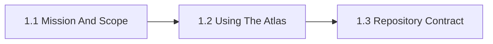

# 1. Scope And Principles

This chapter is the front door for Scope And Principles. It defines the atlas mission, audience, scope, and repository contract so later chapters do not have to restate the same framing. The chapter is designed to help readers move from orientation into real decisions without losing the atlas priorities around openness, sovereignty, portability, privacy, compliance, and lock-in.

Without this chapter, the repository can drift into generic GenAI commentary, duplicated framing, or misaligned contribution patterns.

## Chapter Index

- 1.1 [Mission And Scope](01-01-00-mission-and-scope.md)
- 1.1.1 [Organizational Scope And Boundaries](01-01-01-organizational-scope-and-boundaries.md)
- 1.1.2 [Audience, Roles, And Reader Modes](01-01-02-audience-roles-and-reader-modes.md)
- 1.1.3 [Applied AI And ML Landscape](01-01-03-applied-ai-and-ml-landscape.md)
- 1.1.4 [Atlas Priorities: Openness, Sovereignty, Portability, Privacy, Compliance](01-01-04-atlas-priorities-openness-sovereignty-portability-privacy-compliance.md)
- 1.2 [Using The Atlas](01-02-00-using-the-atlas.md)
- 1.2.1 [Role-Based Reading Paths](01-02-01-role-based-reading-paths.md)
- 1.2.2 [Worked Reader Journeys](01-02-02-worked-reader-journeys.md)
- 1.3 [Repository Contract](01-03-00-repository-contract.md)
- 1.3.1 [Root Docs And Topic Chapters](01-03-01-root-docs-and-topic-chapters.md)

## Why This Chapter Exists

The atlas uses chapter front doors as real chapter maps, not as thin navigation stubs. This chapter therefore has to do more than list files. It should explain why the topic matters, show how the chapter is segmented, and help a reader choose the right depth before they disappear into detailed tables or worked examples.

That matters here because scope and principles is rarely a self-contained question. Decisions in this chapter usually spill into adjacent chapters about governance, data boundaries, evidence, security, operations, or sourcing. The front door keeps those relationships visible before local optimization starts.

## Chapter Shape

## What This Chapter Helps Decide

- whether a topic belongs in the atlas at all
- which reader mode and reading path fits a given need
- which cross-cutting priorities should stay visible throughout later decisions
- which adjacent chapters should be read next because the issue is no longer only about scope and principles

## How To Use This Chapter

Start with the first section when the language, scope, or boundary of the topic is still unstable. Move to the second section when the question becomes operational and the team needs practical sequencing, scenarios, or review logic. Use the third section after the conceptual and operating frame is clear enough that named tools, standards, controls, or reference artifacts will sharpen the decision rather than replace it.

If you are reviewing a proposal rather than designing one, use the chapter map to confirm which section the proposal really belongs in. That small check prevents detailed reference material from being mistaken for the whole argument.

## Adjacent Chapters

- Next: [2. Taxonomy](../02-taxonomy/02-00-00-taxonomy.md)
- Repository guidance: [Contributing](../../CONTRIBUTING.md), [Editorial Rules](../../EDITORIAL_RULES.md)
