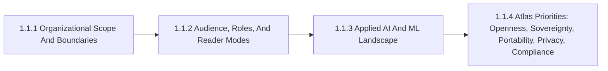

# 1.1 Mission And Scope

This section lays the conceptual foundation for Scope And Principles. Within the chapter, it defines the atlas mission, audience, scope, and repository contract so later chapters do not have to restate the same framing, but the emphasis here is narrower: this section exists to establish a shared vocabulary, stable distinctions, and the minimum conceptual frame required before comparison or implementation makes sense.

## Section Map

- 1.1.1 [Organizational Scope And Boundaries](01-01-01-organizational-scope-and-boundaries.md)
- 1.1.2 [Audience, Roles, And Reader Modes](01-01-02-audience-roles-and-reader-modes.md)
- 1.1.3 [Applied AI And ML Landscape](01-01-03-applied-ai-and-ml-landscape.md)
- 1.1.4 [Atlas Priorities: Openness, Sovereignty, Portability, Privacy, Compliance](01-01-04-atlas-priorities-openness-sovereignty-portability-privacy-compliance.md)

## Why This Section Exists

This section exists to establish a shared vocabulary, stable distinctions, and the minimum conceptual frame required before comparison or implementation makes sense. It gives readers a stable place to answer the questions that are most likely to be confused inside scope and principles, which makes later comparison more reliable because it rests on a shared frame instead of local shorthand.

This section should also be read as part of the atlas mission rather than as a self-contained mini-essay. The point is to surface how mission and scope changes control, portability, sovereignty, privacy, compliance, and operating burden in real organizational systems.

## Section Shape

## What To Look For Here

- the definitions and boundaries that should remain stable across the chapter
- the trade-offs or category errors that would distort later comparisons
- the chapter-specific lenses that should stay visible in reviews and designs
- where the section should hand the reader off to adjacent chapters instead of trying to answer everything locally

## Reading Guidance

Read this section first whenever the team is still arguing about terms, boundaries, or which problem family is actually in scope. When in doubt, ask whether the material here changes a real decision, review, or operating posture. If it does not, go back up one level and confirm that the right chapter or section is being used.

## Review Prompts

- Are the chapter terms being used consistently with the taxonomy in chapter 2?
- Would a new contributor understand what belongs in this chapter and what belongs elsewhere?
- Do the distinctions here change a real design or review decision later in the stack?

Back to [1. Scope And Principles](01-00-00-scope-and-principles.md).
