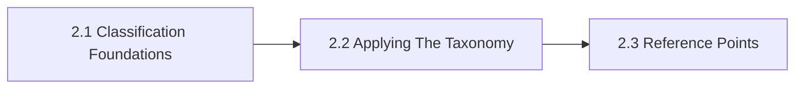

# 2. Taxonomy

This chapter is the front door for Taxonomy. It provides the canonical taxonomy that keeps tools, models, standards, vendors, controls, and use cases from collapsing into one mixed category. The chapter is designed to help readers move from orientation into real decisions without losing the atlas priorities around openness, sovereignty, portability, privacy, compliance, and lock-in.

Skipping the taxonomy layer usually produces misleading tables and local terminology drift.

## Chapter Index

- 2.1 [Classification Foundations](02-01-00-classification-foundations.md)
- 2.1.1 [Entity Classes And Core Distinctions](02-01-01-entity-classes-and-core-distinctions.md)
- 2.1.2 [Cross-Cutting Dimensions And Heuristics](02-01-02-cross-cutting-dimensions-and-heuristics.md)
- 2.2 [Applying The Taxonomy](02-02-00-applying-the-taxonomy.md)
- 2.2.1 [Worked Classification Scenarios](02-02-01-worked-classification-scenarios.md)
- 2.2.2 [Patterns And Anti-Patterns](02-02-02-patterns-and-anti-patterns.md)
- 2.3 [Reference Points](02-03-00-reference-points.md)
- 2.3.1 [Standards And Bodies](02-03-01-standards-and-bodies.md)

## Why This Chapter Exists

The atlas uses chapter front doors as real chapter maps, not as thin navigation stubs. This chapter therefore has to do more than list files. It should explain why the topic matters, show how the chapter is segmented, and help a reader choose the right depth before they disappear into detailed tables or worked examples.

That matters here because taxonomy is rarely a self-contained question. Decisions in this chapter usually spill into adjacent chapters about governance, data boundaries, evidence, security, operations, or sourcing. The front door keeps those relationships visible before local optimization starts.

## Chapter Shape

## What This Chapter Helps Decide

- what kind of entity is actually being compared
- which taxonomy dimensions belong in a comparison
- whether a proposed distinction is reusable across the atlas
- which adjacent chapters should be read next because the issue is no longer only about taxonomy

## How To Use This Chapter

Start with the first section when the language, scope, or boundary of the topic is still unstable. Move to the second section when the question becomes operational and the team needs practical sequencing, scenarios, or review logic. Use the third section after the conceptual and operating frame is clear enough that named tools, standards, controls, or reference artifacts will sharpen the decision rather than replace it.

If you are reviewing a proposal rather than designing one, use the chapter map to confirm which section the proposal really belongs in. That small check prevents detailed reference material from being mistaken for the whole argument.

## Adjacent Chapters

- Previous: [1. Scope And Principles](../01-scope-and-principles/01-00-00-scope-and-principles.md)
- Next: [3. Enterprise AI Stack Map](../03-enterprise-ai-stack-map/03-00-00-enterprise-ai-stack-map.md)
- Repository guidance: [Contributing](../../CONTRIBUTING.md), [Editorial Rules](../../EDITORIAL_RULES.md)
