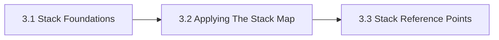

# 3. Enterprise AI Stack Map

This chapter is the front door for Enterprise AI Stack Map. It maps the enterprise AI stack from governance and data boundaries through runtime, assurance, and sourcing so teams can see how system layers interact. The chapter is designed to help readers move from orientation into real decisions without losing the atlas priorities around openness, sovereignty, portability, privacy, compliance, and lock-in.

Without a shared stack map, teams tend to over-focus on models while hiding governance, runtime, and evidence burdens.

## Chapter Index

- 3.1 [Stack Foundations](03-01-00-stack-foundations.md)
- 3.1.1 [Layers, Control Points, And Core Distinctions](03-01-01-layers-control-points-and-core-distinctions.md)
- 3.1.2 [Boundaries, Dependencies, And Reading Heuristics](03-01-02-boundaries-dependencies-and-reading-heuristics.md)
- 3.2 [Applying The Stack Map](03-02-00-applying-the-stack-map.md)
- 3.2.1 [Worked Stack Scenarios](03-02-01-worked-stack-scenarios.md)
- 3.2.2 [Patterns And Anti-Patterns](03-02-02-patterns-and-anti-patterns.md)
- 3.3 [Stack Reference Points](03-03-00-stack-reference-points.md)
- 3.3.1 [Tooling By Layer](03-03-01-tooling-by-layer.md)
- 3.3.2 [Reference Stack Solutions](03-03-02-reference-stack-solutions.md)

## Why This Chapter Exists

The atlas uses chapter front doors as real chapter maps, not as thin navigation stubs. This chapter therefore has to do more than list files. It should explain why the topic matters, show how the chapter is segmented, and help a reader choose the right depth before they disappear into detailed tables or worked examples.

That matters here because enterprise ai stack map is rarely a self-contained question. Decisions in this chapter usually spill into adjacent chapters about governance, data boundaries, evidence, security, operations, or sourcing. The front door keeps those relationships visible before local optimization starts.

## Chapter Shape

## What This Chapter Helps Decide

- where a capability sits in the broader stack
- which control points belong in design review
- which adjacent layers must be revisited when the architecture changes
- which adjacent chapters should be read next because the issue is no longer only about enterprise ai stack map

## How To Use This Chapter

Start with the first section when the language, scope, or boundary of the topic is still unstable. Move to the second section when the question becomes operational and the team needs practical sequencing, scenarios, or review logic. Use the third section after the conceptual and operating frame is clear enough that named tools, standards, controls, or reference artifacts will sharpen the decision rather than replace it.

If you are reviewing a proposal rather than designing one, use the chapter map to confirm which section the proposal really belongs in. That small check prevents detailed reference material from being mistaken for the whole argument.

## Adjacent Chapters

- Previous: [2. Taxonomy](../02-taxonomy/02-00-00-taxonomy.md)
- Next: [4. Governance Risk Compliance](../04-governance-risk-compliance/04-00-00-governance-risk-compliance.md)
- Repository guidance: [Contributing](../../CONTRIBUTING.md), [Editorial Rules](../../EDITORIAL_RULES.md)
