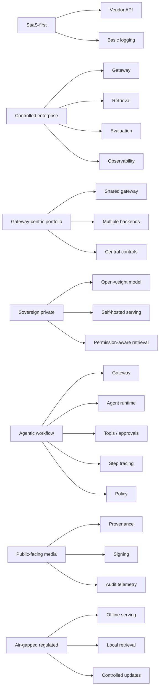

# 3.3.2 Reference Stack Solutions

_Page Type: Comparison Page | Maturity: Draft_

This file groups reusable solution shapes so readers can move from individual layers to coherent stack combinations. It now separates comparable anchors into individual rows rather than hiding multiple tools inside one cell.

## How To Use This File

- These shapes are reusable starting points, not drop-in blueprints.
- A stronger openness tier does not automatically mean lower operating burden.
- Use the chapter front door to understand when a pattern fits before comparing solutions.

## Solution Shapes

| Solution shape | Typical composition | Openness-policy tier | Strongest fit | Main trade-off |
| --- | --- | --- | --- | --- |
| SaaS-first assistant | Vendor model API, thin application layer, basic logging | Controlled Exception | Fast internal assistance and prototyping | Lowest operating burden, highest external dependence |
| Managed enterprise suite | Enterprise workflow suite plus embedded AI capabilities | Controlled Exception | Service, CRM, or productivity estates standardizing on one suite | Fast adoption with the strongest application-level lock-in |
| Controlled enterprise assistant | Gateway, retrieval layer, evaluation loop, observability, approval policy | Acceptable | Multi-team internal knowledge and support use | More design and platform work up front |
| Gateway-centric portfolio stack | Shared gateway, policy layer, model routing, centralized cost and usage visibility | Acceptable | Organizations with many teams and providers | Gateway becomes a control dependency |
| Sovereign private assistant | Open-weight models, self-hosted serving, permission-aware retrieval, strong logging | Preferred | High-control environments with platform capacity | Higher staffing, infra, and upgrade burden |
| Agentic workflow stack | Gateway, workflow runtime, bounded tools, approval gates, step tracing | Acceptable | Delegated task execution with explicit guardrails | Highest QA and security burden of the common patterns |
| Public-facing media stack | Content generation or verification pipeline plus provenance controls | Acceptable | Synthetic-content publishing and content-authenticity use cases | Provenance and signing work add UX and operational complexity |
| Air-gapped regulated stack | Portable models, offline-capable serving, local retrieval, controlled update path | Strategic Open | Restricted, disconnected, or defense-style environments | Narrower model and integration choice |

## Representative Component Anchors

| Solution shape | Layer | Anchor | Why it fits this pattern | Primary source |
| --- | --- | --- | --- | --- |
| SaaS-first assistant | Model access | [OpenAI Models](https://platform.openai.com/docs/models) | Common API-first anchor for managed assistant deployments | [Docs](https://platform.openai.com/docs/models) |
| SaaS-first assistant | Model access | [Anthropic Claude](https://docs.anthropic.com/) | Similar managed API-first posture for assistant workloads | [Docs](https://docs.anthropic.com/) |
| SaaS-first assistant | Telemetry | [OpenTelemetry](https://opentelemetry.io/) | Even thin SaaS-first stacks benefit from exportable app telemetry | [OTel](https://opentelemetry.io/) |
| Managed enterprise suite | Application layer | [ServiceNow Now Assist](https://www.servicenow.com/products/now-assist.html) | Strong fit in service and workflow-heavy enterprise estates | [ServiceNow](https://www.servicenow.com/products/now-assist.html) |
| Managed enterprise suite | Application layer | [Salesforce Einstein](https://www.salesforce.com/products/einstein-ai-solutions/) | Strong fit in CRM-centered enterprise estates | [Salesforce](https://www.salesforce.com/products/einstein-ai-solutions/) |
| Managed enterprise suite | Application layer | [Microsoft 365 Copilot](https://www.microsoft.com/en-us/microsoft-365/copilot) | Strong fit in Microsoft productivity estates | [Microsoft](https://www.microsoft.com/en-us/microsoft-365/copilot) |
| Controlled enterprise assistant | Gateway | [LiteLLM](https://docs.litellm.ai/) | Common open gateway choice for internal control and routing | [Docs](https://docs.litellm.ai/) |
| Controlled enterprise assistant | Retrieval | [Qdrant](https://qdrant.tech/) | Portable retrieval substrate for internal knowledge systems | [Docs](https://qdrant.tech/documentation/) |
| Controlled enterprise assistant | Evaluation | [Inspect AI](https://inspect.aisi.org.uk/) | Useful when internal assistants need scenario-led evaluation beyond prompt regression alone | [Inspect](https://inspect.aisi.org.uk/) |
| Controlled enterprise assistant | Evaluation | [promptfoo](https://www.promptfoo.dev/) | Common regression layer for internal assistant releases | [Docs](https://www.promptfoo.dev/docs/intro) |
| Controlled enterprise assistant | Observability | [SigNoz](https://signoz.io/docs/) | Strong fit when teams want self-hostable observability beside exportable telemetry | [Docs](https://signoz.io/docs/) |
| Controlled enterprise assistant | Observability | [Langfuse](https://langfuse.com/) | Exportable trace and evaluation telemetry for assistant operations | [Langfuse](https://langfuse.com/) |
| Gateway-centric portfolio stack | Gateway | [Envoy AI Gateway](https://aigateway.envoyproxy.io/) | Self-hosted gateway option for large portfolios | [Docs](https://aigateway.envoyproxy.io/) |
| Gateway-centric portfolio stack | Gateway | [Cloudflare AI Gateway](https://developers.cloudflare.com/ai-gateway/) | Managed shared gateway layer across multiple providers | [Docs](https://developers.cloudflare.com/ai-gateway/) |
| Gateway-centric portfolio stack | Policy | [Open Policy Agent](https://www.openpolicyagent.org/) | Useful policy-as-code layer beside shared routing | [OPA](https://www.openpolicyagent.org/) |
| Sovereign private assistant | Serving runtime | [vLLM](https://docs.vllm.ai/) | Portable self-hosted serving backbone | [Docs](https://docs.vllm.ai/) |
| Sovereign private assistant | Serving runtime | [Hugging Face TGI](https://huggingface.co/docs/text-generation-inference/index) | Alternative portable self-hosted serving runtime | [Docs](https://huggingface.co/docs/text-generation-inference/index) |
| Sovereign private assistant | Serving platform | [Seldon Core 2](https://docs.seldon.ai/seldon-core-v2/) | Useful where sovereign deployments need standardized multi-model serving control planes | [Docs](https://docs.seldon.ai/seldon-core-v2/) |
| Sovereign private assistant | Retrieval | [pgvector](https://github.com/pgvector/pgvector) | Keeps more of the knowledge layer inside existing database estates | [Repo](https://github.com/pgvector/pgvector) |
| Sovereign private assistant | Telemetry | [OpenTelemetry](https://opentelemetry.io/) | Exportable telemetry is central to sovereign evidence posture | [OTel](https://opentelemetry.io/) |
| Agentic workflow stack | Orchestration | [LangGraph](https://langchain-ai.github.io/langgraph/) | Common agent workflow runtime for tool-using systems | [Docs](https://langchain-ai.github.io/langgraph/) |
| Agentic workflow stack | Durable execution | [Temporal](https://temporal.io/) | Strong fit when retries, resumability, and step control matter | [Docs](https://docs.temporal.io/) |
| Agentic workflow stack | Policy | [Open Policy Agent](https://www.openpolicyagent.org/) | Policy-as-code is useful around bounded action and approvals | [OPA](https://www.openpolicyagent.org/) |
| Agentic workflow stack | Step tracing | [Langfuse](https://langfuse.com/) | Common trace layer for tool use and step inspection | [Langfuse](https://langfuse.com/) |
| Public-facing media stack | Provenance | [C2PA](https://c2pa.org/) | Core authenticity and provenance anchor for published synthetic content | [C2PA](https://c2pa.org/) |
| Public-facing media stack | Signing | [Sigstore](https://www.sigstore.dev/) | Useful signing and verification layer for supporting artifacts | [Sigstore](https://www.sigstore.dev/) |
| Public-facing media stack | Audit telemetry | [OpenTelemetry](https://opentelemetry.io/) | Exportable traces remain important for public incident review | [OTel](https://opentelemetry.io/) |
| Air-gapped regulated stack | Serving runtime | [vLLM](https://docs.vllm.ai/) | Common portable runtime when external API access is not allowed | [Docs](https://docs.vllm.ai/) |
| Air-gapped regulated stack | Edge serving | [OpenVINO Model Server](https://docs.openvino.ai/2025/openvino-workflow/model-server/ovms_what_is_openvino_model_server.html) | Useful where disconnected edge or CPU-heavy estates still need governed local inference | [Docs](https://docs.openvino.ai/2025/openvino-workflow/model-server/ovms_what_is_openvino_model_server.html) |
| Air-gapped regulated stack | Optimization layer | [TensorRT-LLM](https://docs.nvidia.com/tensorrt-llm/index.html) | Useful where offline GPU estates are standardized and performance matters | [Docs](https://docs.nvidia.com/tensorrt-llm/index.html) |
| Air-gapped regulated stack | Retrieval | [Milvus](https://milvus.io/) | Portable local retrieval layer for disconnected environments | [Docs](https://milvus.io/docs) |

## Solutions Map

## Selection Notes

| Situation | Default bias |
| --- | --- |
| Early experimentation with low data sensitivity | SaaS-first assistant |
| Broad internal rollout across many teams | Controlled enterprise or gateway-centric portfolio |
| Strong sovereignty or exit requirement | Sovereign private |
| Action-taking workflows | Agentic workflow only with approvals and strong observability |
| Public synthetic-content exposure | Public-facing media stack with provenance and authenticity controls |
| Restricted or disconnected operations | Air-gapped regulated |

## Reading Notes

- Re-check the main chapter if the comparison starts to feel more detailed than the underlying decision.
- Prefer adjacent chapter context over treating a single table row as a final answer.

Back to [3.3 Stack Reference Points](03-03-00-stack-reference-points.md).
