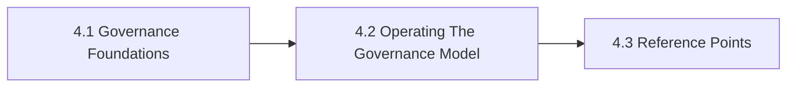

# 4. Governance Risk Compliance

This chapter is the front door for Governance Risk Compliance. It anchors governance, accountability, policy ownership, and compliance review as operational design work rather than after-the-fact approval theater. The chapter is designed to help readers move from orientation into real decisions without losing the atlas priorities around openness, sovereignty, portability, privacy, compliance, and lock-in.

If governance is treated as paperwork instead of operating design, organizations discover accountability gaps only after incidents or audits.

## Chapter Index

- 4.1 [Governance Foundations](04-01-00-governance-foundations.md)
- 4.1.1 [Policy, Ownership, And Control Mapping](04-01-01-policy-ownership-and-control-mapping.md)
- 4.1.2 [Decision Boundaries And Review Heuristics](04-01-02-decision-boundaries-and-review-heuristics.md)
- 4.2 [Operating The Governance Model](04-02-00-operating-the-governance-model.md)
- 4.2.1 [Worked Governance Scenarios](04-02-01-worked-governance-scenarios.md)
- 4.2.2 [Patterns And Anti-Patterns](04-02-02-patterns-and-anti-patterns.md)
- 4.3 [Reference Points](04-03-00-reference-points.md)
- 4.3.1 [Standards And Bodies](04-03-01-standards-and-bodies.md)
- 4.3.2 [Controls And Artifacts](04-03-02-controls-and-artifacts.md)

## Why This Chapter Exists

The atlas uses chapter front doors as real chapter maps, not as thin navigation stubs. This chapter therefore has to do more than list files. It should explain why the topic matters, show how the chapter is segmented, and help a reader choose the right depth before they disappear into detailed tables or worked examples.

That matters here because governance risk compliance is rarely a self-contained question. Decisions in this chapter usually spill into adjacent chapters about governance, data boundaries, evidence, security, operations, or sourcing. The front door keeps those relationships visible before local optimization starts.

## Chapter Shape

## What This Chapter Helps Decide

- who owns policy and review authority
- which controls are governance controls versus technical controls
- when an initiative should escalate for legal, risk, or executive review
- which adjacent chapters should be read next because the issue is no longer only about governance risk compliance

## How To Use This Chapter

Start with the first section when the language, scope, or boundary of the topic is still unstable. Move to the second section when the question becomes operational and the team needs practical sequencing, scenarios, or review logic. Use the third section after the conceptual and operating frame is clear enough that named tools, standards, controls, or reference artifacts will sharpen the decision rather than replace it.

If you are reviewing a proposal rather than designing one, use the chapter map to confirm which section the proposal really belongs in. That small check prevents detailed reference material from being mistaken for the whole argument.

## Adjacent Chapters

- Previous: [3. Enterprise AI Stack Map](../03-enterprise-ai-stack-map/03-00-00-enterprise-ai-stack-map.md)
- Next: [5. Use Cases And Application Landscapes](../05-use-cases-and-application-landscapes/05-00-00-use-cases-and-application-landscapes.md)
- Repository guidance: [Contributing](../../CONTRIBUTING.md), [Editorial Rules](../../EDITORIAL_RULES.md)
