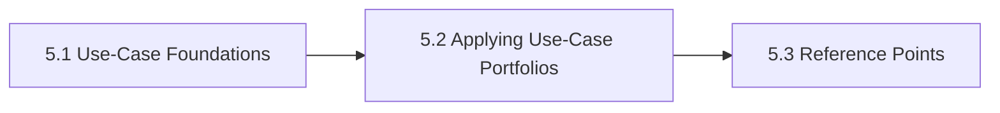

# 5. Use Cases And Application Landscapes

This chapter is the front door for Use Cases And Application Landscapes. It organizes applied AI demand into reusable use-case families so portfolios are shaped by real work patterns instead of product fashion. The chapter is designed to help readers move from orientation into real decisions without losing the atlas priorities around openness, sovereignty, portability, privacy, compliance, and lock-in.

Teams that skip this chapter often fund tools before they have a clear view of the work pattern, consequence profile, or operating owner.

## Chapter Index

- 5.1 [Use-Case Foundations](05-01-00-use-case-foundations.md)
- 5.1.1 [Task Classes, Autonomy, And Core Distinctions](05-01-01-task-classes-autonomy-and-core-distinctions.md)
- 5.1.2 [Portfolio Boundaries And Prioritization Heuristics](05-01-02-portfolio-boundaries-and-prioritization-heuristics.md)
- 5.2 [Applying Use-Case Portfolios](05-02-00-applying-use-case-portfolios.md)
- 5.2.1 [Worked Use-Case Scenarios](05-02-01-worked-use-case-scenarios.md)
- 5.2.2 [Patterns And Anti-Patterns](05-02-02-patterns-and-anti-patterns.md)
- 5.3 [Reference Points](05-03-00-reference-points.md)
- 5.3.1 [Tools And Platforms](05-03-01-tools-and-platforms.md)

## Why This Chapter Exists

The atlas uses chapter front doors as real chapter maps, not as thin navigation stubs. This chapter therefore has to do more than list files. It should explain why the topic matters, show how the chapter is segmented, and help a reader choose the right depth before they disappear into detailed tables or worked examples.

That matters here because use cases and application landscapes is rarely a self-contained question. Decisions in this chapter usually spill into adjacent chapters about governance, data boundaries, evidence, security, operations, or sourcing. The front door keeps those relationships visible before local optimization starts.

## Chapter Shape

## What This Chapter Helps Decide

- which use-case family a proposal actually belongs to
- where worker-facing and organization-facing systems differ
- which portfolio should scale first and which should stay experimental
- which adjacent chapters should be read next because the issue is no longer only about use cases and application landscapes

## How To Use This Chapter

Start with the first section when the language, scope, or boundary of the topic is still unstable. Move to the second section when the question becomes operational and the team needs practical sequencing, scenarios, or review logic. Use the third section after the conceptual and operating frame is clear enough that named tools, standards, controls, or reference artifacts will sharpen the decision rather than replace it.

If you are reviewing a proposal rather than designing one, use the chapter map to confirm which section the proposal really belongs in. That small check prevents detailed reference material from being mistaken for the whole argument.

## Adjacent Chapters

- Previous: [4. Governance Risk Compliance](../04-governance-risk-compliance/04-00-00-governance-risk-compliance.md)
- Next: [6. Data Sovereignty And Privacy](../06-data-sovereignty-and-privacy/06-00-00-data-sovereignty-and-privacy.md)
- Repository guidance: [Contributing](../../CONTRIBUTING.md), [Editorial Rules](../../EDITORIAL_RULES.md)
