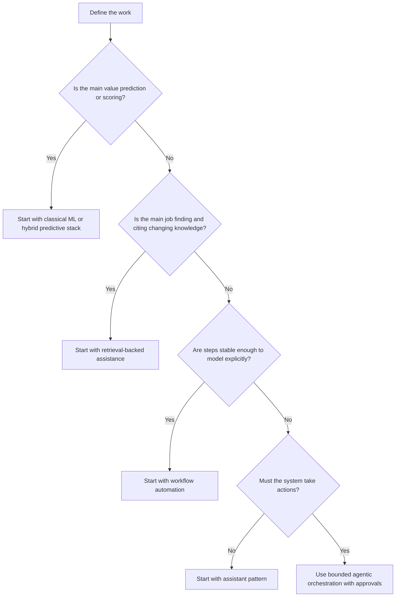

# 5.1.3 Solution Pattern Selection Guide

_Page Type: Decision Guide | Maturity: Draft_

Use this guide when a team knows the business problem but has not yet chosen the solution pattern. The goal is to stop “agent”, “copilot”, “RAG”, and “automation” from becoming default answers before the work pattern is understood.

## Fast Triage

| If the work is primarily... | Start with... | Escalate only if... |
| --- | --- | --- |
| Drafting, summarizing, or explaining for a human reviewer | Assistant pattern | The system must also take actions or coordinate multi-step work |
| Answering from changing internal knowledge | Retrieval-backed assistant | Long-lived personalized state or tool execution is materially required |
| Executing repeatable business steps with approvals | Deterministic workflow | The steps cannot be specified well enough in advance |
| Predicting, ranking, forecasting, or scoring | Classical ML or hybrid predictive stack | Language interaction is a major part of the user experience |
| Extracting or classifying structured document content | Document intelligence workflow | The main bottleneck is reasoning over many sources, not extraction |
| Taking actions across systems with bounded autonomy | Agentic orchestration | The work can be made durable and legible as a workflow instead |

## Decision Tree

## Selection Checks

- Choose retrieval before memory when facts change often and permissions matter.
- Choose workflow before agents when approvals, retries, and audit trails are predictable.
- Choose classical ML before a language interface when the core task is ranking, forecasting, anomaly detection, or optimization.
- Choose hybrid composition when the organization needs both prediction and explanation, not when it is only collecting trendy components.

## Escalation Triggers

- Move from assistant to workflow or agent only when side effects, approvals, or multi-system coordination are real requirements.
- Move from retrieval to memory only when durable cross-session state creates user value that justifies retention, governance, and deletion obligations.
- Move from managed product suites to modular architectures when control, portability, or sourcing posture become first-order constraints.

Back to [5.1 Use-Case Foundations](05-01-00-use-case-foundations.md).
