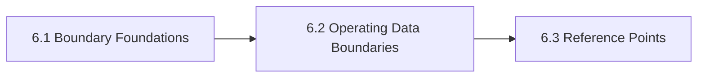

# 6. Data Sovereignty And Privacy

This chapter is the front door for Data Sovereignty And Privacy. It separates privacy, sovereignty, portability, and control questions so data-boundary decisions reflect the real operational surface. The chapter is designed to help readers move from orientation into real decisions without losing the atlas priorities around openness, sovereignty, portability, privacy, compliance, and lock-in.

If privacy and sovereignty are reduced to region selection alone, organizations miss control-plane and lifecycle risks that matter just as much.

## Chapter Index

- 6.1 [Boundary Foundations](06-01-00-boundary-foundations.md)
- 6.1.1 [Data Classes, Residency, And Control Distinctions](06-01-01-data-classes-residency-and-control-distinctions.md)
- 6.1.2 [Decision Boundaries And Handling Heuristics](06-01-02-decision-boundaries-and-handling-heuristics.md)
- 6.2 [Operating Data Boundaries](06-02-00-operating-data-boundaries.md)
- 6.2.1 [Worked Privacy And Sovereignty Scenarios](06-02-01-worked-privacy-and-sovereignty-scenarios.md)
- 6.2.2 [Patterns And Anti-Patterns](06-02-02-patterns-and-anti-patterns.md)
- 6.3 [Reference Points](06-03-00-reference-points.md)
- 6.3.1 [Standards And Bodies](06-03-01-standards-and-bodies.md)
- 6.3.2 [Controls And Artifacts](06-03-02-controls-and-artifacts.md)

## Why This Chapter Exists

The atlas uses chapter front doors as real chapter maps, not as thin navigation stubs. This chapter therefore has to do more than list files. It should explain why the topic matters, show how the chapter is segmented, and help a reader choose the right depth before they disappear into detailed tables or worked examples.

That matters here because data sovereignty and privacy is rarely a self-contained question. Decisions in this chapter usually spill into adjacent chapters about governance, data boundaries, evidence, security, operations, or sourcing. The front door keeps those relationships visible before local optimization starts.

## Chapter Shape

## What This Chapter Helps Decide

- which data classes and states need distinct handling
- whether residency claims match actual control posture
- which telemetry, memory, and support pathways create hidden exposure
- which adjacent chapters should be read next because the issue is no longer only about data sovereignty and privacy

## How To Use This Chapter

Start with the first section when the language, scope, or boundary of the topic is still unstable. Move to the second section when the question becomes operational and the team needs practical sequencing, scenarios, or review logic. Use the third section after the conceptual and operating frame is clear enough that named tools, standards, controls, or reference artifacts will sharpen the decision rather than replace it.

If you are reviewing a proposal rather than designing one, use the chapter map to confirm which section the proposal really belongs in. That small check prevents detailed reference material from being mistaken for the whole argument.

## Adjacent Chapters

- Previous: [5. Use Cases And Application Landscapes](../05-use-cases-and-application-landscapes/05-00-00-use-cases-and-application-landscapes.md)
- Next: [7. Model Ecosystem](../07-model-ecosystem/07-00-00-model-ecosystem.md)
- Repository guidance: [Contributing](../../CONTRIBUTING.md), [Editorial Rules](../../EDITORIAL_RULES.md)
