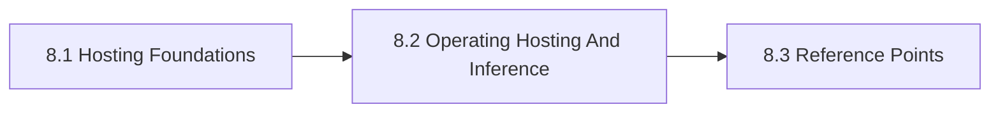

# 8. Model Hosting And Inference

This chapter is the front door for Model Hosting And Inference. It examines hosting and inference as a control problem involving latency, cost, hardware, availability, and operational ownership. The chapter is designed to help readers move from orientation into real decisions without losing the atlas priorities around openness, sovereignty, portability, privacy, compliance, and lock-in.

Treating hosting as a late infrastructure detail usually creates avoidable lock-in, cost, and support surprises.

## Chapter Index

- 8.1 [Hosting Foundations](08-01-00-hosting-foundations.md)
- 8.1.1 [Runtime Postures, Constraints, And Core Distinctions](08-01-01-runtime-postures-constraints-and-core-distinctions.md)
- 8.1.2 [Decision Boundaries And Deployment Heuristics](08-01-02-decision-boundaries-and-deployment-heuristics.md)
- 8.2 [Operating Hosting And Inference](08-02-00-operating-hosting-and-inference.md)
- 8.2.1 [Worked Hosting Scenarios](08-02-01-worked-hosting-scenarios.md)
- 8.2.2 [Patterns And Anti-Patterns](08-02-02-patterns-and-anti-patterns.md)
- 8.3 [Reference Points](08-03-00-reference-points.md)
- 8.3.1 [Tools And Platforms](08-03-01-tools-and-platforms.md)
- 8.3.2 [Reference Stack Solutions](08-03-02-reference-stack-solutions.md)

## Why This Chapter Exists

The atlas uses chapter front doors as real chapter maps, not as thin navigation stubs. This chapter therefore has to do more than list files. It should explain why the topic matters, show how the chapter is segmented, and help a reader choose the right depth before they disappear into detailed tables or worked examples.

That matters here because model hosting and inference is rarely a self-contained question. Decisions in this chapter usually spill into adjacent chapters about governance, data boundaries, evidence, security, operations, or sourcing. The front door keeps those relationships visible before local optimization starts.

## Chapter Shape

## What This Chapter Helps Decide

- where models should run and under whose control
- which runtime posture matches cost and assurance needs
- when managed convenience outweighs self-hosted control and vice versa
- which adjacent chapters should be read next because the issue is no longer only about model hosting and inference

## How To Use This Chapter

Start with the first section when the language, scope, or boundary of the topic is still unstable. Move to the second section when the question becomes operational and the team needs practical sequencing, scenarios, or review logic. Use the third section after the conceptual and operating frame is clear enough that named tools, standards, controls, or reference artifacts will sharpen the decision rather than replace it.

If you are reviewing a proposal rather than designing one, use the chapter map to confirm which section the proposal really belongs in. That small check prevents detailed reference material from being mistaken for the whole argument.

## Adjacent Chapters

- Previous: [7. Model Ecosystem](../07-model-ecosystem/07-00-00-model-ecosystem.md)
- Next: [9. Model Gateways And Access Control](../09-model-gateways-and-access-control/09-00-00-model-gateways-and-access-control.md)
- Repository guidance: [Contributing](../../CONTRIBUTING.md), [Editorial Rules](../../EDITORIAL_RULES.md)
