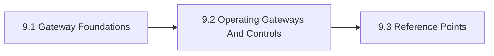

# 9. Model Gateways And Access Control

This chapter is the front door for Model Gateways And Access Control. It positions gateways, routing, identity, and policy enforcement as shared controls that sit between model access and organizational accountability. The chapter is designed to help readers move from orientation into real decisions without losing the atlas priorities around openness, sovereignty, portability, privacy, compliance, and lock-in.

Direct model access without a clear control layer tends to fragment policy, observability, and cost governance.

## Chapter Index

- 9.1 [Gateway Foundations](09-01-00-gateway-foundations.md)
- 9.1.1 [Routing, Identity, And Policy Distinctions](09-01-01-routing-identity-and-policy-distinctions.md)
- 9.1.2 [Decision Boundaries And Adoption Heuristics](09-01-02-decision-boundaries-and-adoption-heuristics.md)
- 9.2 [Operating Gateways And Controls](09-02-00-operating-gateways-and-controls.md)
- 9.2.1 [Worked Gateway Scenarios](09-02-01-worked-gateway-scenarios.md)
- 9.2.2 [Patterns And Anti-Patterns](09-02-02-patterns-and-anti-patterns.md)
- 9.3 [Reference Points](09-03-00-reference-points.md)
- 9.3.1 [Tools And Platforms](09-03-01-tools-and-platforms.md)
- 9.3.2 [Controls And Artifacts](09-03-02-controls-and-artifacts.md)

## Why This Chapter Exists

The atlas uses chapter front doors as real chapter maps, not as thin navigation stubs. This chapter therefore has to do more than list files. It should explain why the topic matters, show how the chapter is segmented, and help a reader choose the right depth before they disappear into detailed tables or worked examples.

That matters here because model gateways and access control is rarely a self-contained question. Decisions in this chapter usually spill into adjacent chapters about governance, data boundaries, evidence, security, operations, or sourcing. The front door keeps those relationships visible before local optimization starts.

## Chapter Shape

## What This Chapter Helps Decide

- whether a gateway layer is needed
- where policy enforcement and routing logic should live
- how access, quotas, logging, and approval should be applied across providers
- which adjacent chapters should be read next because the issue is no longer only about model gateways and access control

## How To Use This Chapter

Start with the first section when the language, scope, or boundary of the topic is still unstable. Move to the second section when the question becomes operational and the team needs practical sequencing, scenarios, or review logic. Use the third section after the conceptual and operating frame is clear enough that named tools, standards, controls, or reference artifacts will sharpen the decision rather than replace it.

If you are reviewing a proposal rather than designing one, use the chapter map to confirm which section the proposal really belongs in. That small check prevents detailed reference material from being mistaken for the whole argument.

## Adjacent Chapters

- Previous: [8. Model Hosting And Inference](../08-model-hosting-and-inference/08-00-00-model-hosting-and-inference.md)
- Next: [10. Agentic Systems And Orchestration](../10-agentic-systems-and-orchestration/10-00-00-agentic-systems-and-orchestration.md)
- Repository guidance: [Contributing](../../CONTRIBUTING.md), [Editorial Rules](../../EDITORIAL_RULES.md)
