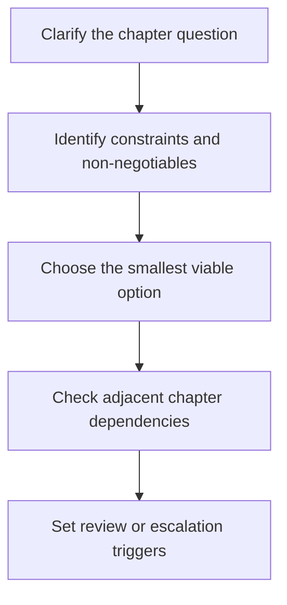

# 9.1.2 Decision Boundaries And Adoption Heuristics

_Page Type: Decision Guide | Maturity: Draft_

This subsection explains how to read the chapter well, where its boundaries sit, and which recurring mistakes distort decisions.

This file exists because model gateways and access control usually involves judgment under incomplete information. Heuristics do not replace evidence, but they help teams avoid false certainty and force the most important trade-offs into the open before a local preference hardens into policy or architecture.

## Why These Heuristics Matter

A good heuristic should make a decision safer, faster, and more reviewable. It should also make clear when the team has moved beyond a heuristic and now needs stronger evidence, broader review, or a different chapter entirely.

## Decision Flow

## Reading The Chapter

Use this chapter to anchor the topic before dropping into implementation details, examples, or comparison material. The goal is not to replace the deeper files in the folder. The goal is to make the chapter readable as a front door and to surface the questions that matter most.

## Reading Heuristics

- Start with this front door if you need the chapter's main distinctions and failure modes.
- Move to the implementation guide when you need rollout, review, or operating advice.
- Use the examples file when the topic feels too abstract and you need a concrete scenario.
- Use typed resource files for named tools, standards, or vendor comparison rather than for conceptual orientation.

## Common Reader Mistakes

- Jumping straight to tools before the chapter's core distinctions are clear.
- Treating one table or one pattern as if it covered the entire topic.
- Ignoring adjacent chapters that shape the same decision from another angle.

## Open Questions

- Which parts of this chapter deserve deeper worked examples in future passes?
- Which distinctions are stable enough to stay canonical across future expansions?

## Review Questions

- Which constraint or risk is this heuristic trying to make visible?
- What would cause the team to escalate beyond a rule of thumb into deeper review?
- Are the heuristics here still consistent with the taxonomy and chapter boundaries of the atlas?

## Practical Reading Rule

Use this file when a team needs a disciplined default, not a permanent shortcut. If the heuristics stop matching the system consequence, scale, or evidence burden, revisit the chapter from the top.

Back to [9.1 Gateway Foundations](09-01-00-gateway-foundations.md).
