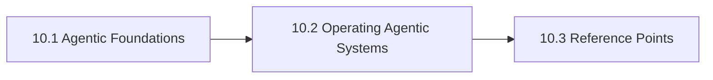

# 10. Agentic Systems And Orchestration

This chapter is the front door for Agentic Systems And Orchestration. It separates assistants, workflows, and higher-autonomy agents so orchestration choices are reviewed against the right failure modes and operating risks. The chapter is designed to help readers move from orientation into real decisions without losing the atlas priorities around openness, sovereignty, portability, privacy, compliance, and lock-in.

Agentic systems are easiest to oversell when teams skip the distinctions between bounded execution, tool use, and open-ended autonomy.

## Chapter Index

- 10.1 [Agentic Foundations](10-01-00-agentic-foundations.md)
- 10.1.1 [Autonomy, Tool Use, And Execution Distinctions](10-01-01-autonomy-tool-use-and-execution-distinctions.md)
- 10.1.2 [Decision Boundaries And Orchestration Heuristics](10-01-02-decision-boundaries-and-orchestration-heuristics.md)
- 10.2 [Operating Agentic Systems](10-02-00-operating-agentic-systems.md)
- 10.2.1 [Worked Agentic Scenarios](10-02-01-worked-agentic-scenarios.md)
- 10.2.2 [Patterns And Anti-Patterns](10-02-02-patterns-and-anti-patterns.md)
- 10.3 [Reference Points](10-03-00-reference-points.md)
- 10.3.1 [Tools And Platforms](10-03-01-tools-and-platforms.md)
- 10.3.2 [Controls And Artifacts](10-03-02-controls-and-artifacts.md)

## Why This Chapter Exists

The atlas uses chapter front doors as real chapter maps, not as thin navigation stubs. This chapter therefore has to do more than list files. It should explain why the topic matters, show how the chapter is segmented, and help a reader choose the right depth before they disappear into detailed tables or worked examples.

That matters here because agentic systems and orchestration is rarely a self-contained question. Decisions in this chapter usually spill into adjacent chapters about governance, data boundaries, evidence, security, operations, or sourcing. The front door keeps those relationships visible before local optimization starts.

## Chapter Shape

## What This Chapter Helps Decide

- what autonomy level is actually justified
- when durable workflows beat free-form agents
- which controls and rollback paths are required before broader deployment
- which adjacent chapters should be read next because the issue is no longer only about agentic systems and orchestration

## How To Use This Chapter

Start with the first section when the language, scope, or boundary of the topic is still unstable. Move to the second section when the question becomes operational and the team needs practical sequencing, scenarios, or review logic. Use the third section after the conceptual and operating frame is clear enough that named tools, standards, controls, or reference artifacts will sharpen the decision rather than replace it.

If you are reviewing a proposal rather than designing one, use the chapter map to confirm which section the proposal really belongs in. That small check prevents detailed reference material from being mistaken for the whole argument.

## Adjacent Chapters

- Previous: [9. Model Gateways And Access Control](../09-model-gateways-and-access-control/09-00-00-model-gateways-and-access-control.md)
- Next: [11. Knowledge Retrieval And Memory](../11-knowledge-retrieval-and-memory/11-00-00-knowledge-retrieval-and-memory.md)
- Repository guidance: [Contributing](../../CONTRIBUTING.md), [Editorial Rules](../../EDITORIAL_RULES.md)
