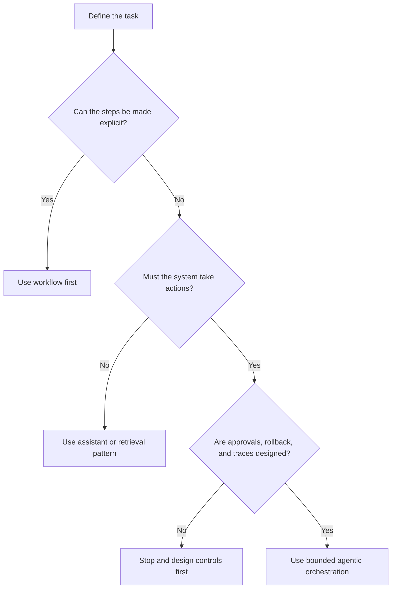

# 10.1.3 Agent Vs Workflow Decision Guide

_Page Type: Decision Guide | Maturity: Draft_

Use this guide when a team is deciding whether a task needs an agentic runtime or whether explicit workflow design is the safer and more durable answer.

## Fast Comparison

| Question | Bias toward workflow | Bias toward agent |
| --- | --- | --- |
| Are steps, approvals, and handoffs already known? | Yes | No |
| Are side effects hard to reverse? | Yes | Only with strong controls |
| Does the task depend on open-ended tool choice or plan synthesis? | No | Yes |
| Is auditability more important than flexibility? | Yes | Only if traces and approvals are first-class |
| Would failure look like missed business process logic rather than weak reasoning? | Yes | No |

## Decision Rule

## Escalation Conditions

- Escalate from workflow to agent only when the value comes from plan synthesis or dynamic tool selection rather than from skipped process design.
- Escalate from assistant to agent only when the system must take actions, not merely produce recommendations.
- De-escalate from agent to workflow when the team can name the steps after one or two pilots and the remaining value is operational discipline.

## Review Questions

- If the model were removed, would the remaining system still look like a business workflow?
- Which actions require human approval, and which are safe to automate completely?
- How will the team investigate a failure that crosses reasoning, tool use, and external side effects?

Back to [10.1 Agentic Foundations](10-01-00-agentic-foundations.md).
