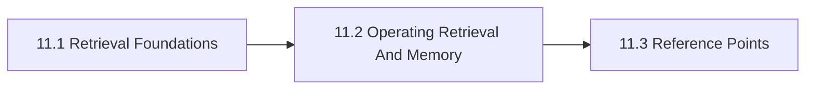

# 11. Knowledge Retrieval And Memory

This chapter is the front door for Knowledge Retrieval And Memory. It explains retrieval, memory, provenance, and knowledge state so teams can decide what should be looked up, remembered, or kept out of persistent system state. The chapter is designed to help readers move from orientation into real decisions without losing the atlas priorities around openness, sovereignty, portability, privacy, compliance, and lock-in.

Knowledge systems fail quietly when persistence, permissions, and provenance are treated as implementation details.

## Chapter Index

- 11.1 [Retrieval Foundations](11-01-00-retrieval-foundations.md)
- 11.1.1 [Knowledge State, Provenance, And Core Distinctions](11-01-01-knowledge-state-provenance-and-core-distinctions.md)
- 11.1.2 [Decision Boundaries And Retrieval Heuristics](11-01-02-decision-boundaries-and-retrieval-heuristics.md)
- 11.2 [Operating Retrieval And Memory](11-02-00-operating-retrieval-and-memory.md)
- 11.2.1 [Worked Retrieval Scenarios](11-02-01-worked-retrieval-scenarios.md)
- 11.2.2 [Patterns And Anti-Patterns](11-02-02-patterns-and-anti-patterns.md)
- 11.3 [Reference Points](11-03-00-reference-points.md)
- 11.3.1 [Tools And Platforms](11-03-01-tools-and-platforms.md)

## Why This Chapter Exists

The atlas uses chapter front doors as real chapter maps, not as thin navigation stubs. This chapter therefore has to do more than list files. It should explain why the topic matters, show how the chapter is segmented, and help a reader choose the right depth before they disappear into detailed tables or worked examples.

That matters here because knowledge retrieval and memory is rarely a self-contained question. Decisions in this chapter usually spill into adjacent chapters about governance, data boundaries, evidence, security, operations, or sourcing. The front door keeps those relationships visible before local optimization starts.

## Chapter Shape

## What This Chapter Helps Decide

- when retrieval is preferable to memory
- what kinds of state should persist and for how long
- how permissions, provenance, and freshness should travel through the system
- which adjacent chapters should be read next because the issue is no longer only about knowledge retrieval and memory

## How To Use This Chapter

Start with the first section when the language, scope, or boundary of the topic is still unstable. Move to the second section when the question becomes operational and the team needs practical sequencing, scenarios, or review logic. Use the third section after the conceptual and operating frame is clear enough that named tools, standards, controls, or reference artifacts will sharpen the decision rather than replace it.

If you are reviewing a proposal rather than designing one, use the chapter map to confirm which section the proposal really belongs in. That small check prevents detailed reference material from being mistaken for the whole argument.

## Adjacent Chapters

- Previous: [10. Agentic Systems And Orchestration](../10-agentic-systems-and-orchestration/10-00-00-agentic-systems-and-orchestration.md)
- Next: [12. Training Fine-Tuning And Adaptation](../12-training-fine-tuning-and-adaptation/12-00-00-training-fine-tuning-and-adaptation.md)
- Repository guidance: [Contributing](../../CONTRIBUTING.md), [Editorial Rules](../../EDITORIAL_RULES.md)
