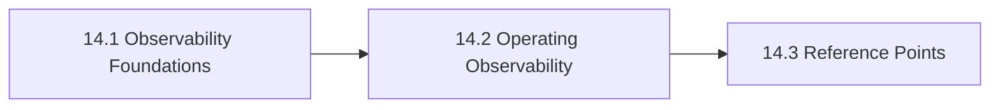

# 14. Observability Logging And Monitoring

This chapter is the front door for Observability Logging And Monitoring. It covers observability, logging, and monitoring as the mechanism for seeing real system behavior rather than relying on model or vendor promises. The chapter is designed to help readers move from orientation into real decisions without losing the atlas priorities around openness, sovereignty, portability, privacy, compliance, and lock-in.

Weak observability makes it hard to distinguish normal variance from drift, misuse, or system regressions.

## Chapter Index

- 14.1 [Observability Foundations](14-01-00-observability-foundations.md)
- 14.1.1 [Signals, Traces, And Core Distinctions](14-01-01-signals-traces-and-core-distinctions.md)
- 14.1.2 [Decision Boundaries And Monitoring Heuristics](14-01-02-decision-boundaries-and-monitoring-heuristics.md)
- 14.2 [Operating Observability](14-02-00-operating-observability.md)
- 14.2.1 [Worked Monitoring Scenarios](14-02-01-worked-monitoring-scenarios.md)
- 14.2.2 [Patterns And Anti-Patterns](14-02-02-patterns-and-anti-patterns.md)
- 14.3 [Reference Points](14-03-00-reference-points.md)
- 14.3.1 [Tools And Platforms](14-03-01-tools-and-platforms.md)
- 14.3.2 [Controls And Artifacts](14-03-02-controls-and-artifacts.md)

## Why This Chapter Exists

The atlas uses chapter front doors as real chapter maps, not as thin navigation stubs. This chapter therefore has to do more than list files. It should explain why the topic matters, show how the chapter is segmented, and help a reader choose the right depth before they disappear into detailed tables or worked examples.

That matters here because observability logging and monitoring is rarely a self-contained question. Decisions in this chapter usually spill into adjacent chapters about governance, data boundaries, evidence, security, operations, or sourcing. The front door keeps those relationships visible before local optimization starts.

## Chapter Shape

## What This Chapter Helps Decide

- which signals matter for system health and risk
- where to instrument the stack
- how monitoring should feed incidents, tuning, and governance review
- which adjacent chapters should be read next because the issue is no longer only about observability logging and monitoring

## How To Use This Chapter

Start with the first section when the language, scope, or boundary of the topic is still unstable. Move to the second section when the question becomes operational and the team needs practical sequencing, scenarios, or review logic. Use the third section after the conceptual and operating frame is clear enough that named tools, standards, controls, or reference artifacts will sharpen the decision rather than replace it.

If you are reviewing a proposal rather than designing one, use the chapter map to confirm which section the proposal really belongs in. That small check prevents detailed reference material from being mistaken for the whole argument.

## Adjacent Chapters

- Previous: [13. Evaluation Testing And QA](../13-evaluation-testing-and-qa/13-00-00-evaluation-testing-and-qa.md)
- Next: [15. Security And Abuse Resistance](../15-security-and-abuse-resistance/15-00-00-security-and-abuse-resistance.md)
- Repository guidance: [Contributing](../../CONTRIBUTING.md), [Editorial Rules](../../EDITORIAL_RULES.md)
