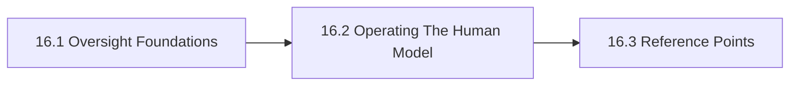

# 16. Human Oversight And Operating Model

This chapter is the front door for Human Oversight And Operating Model. It defines human oversight, decision rights, and operating ownership so people remain visible in the control loop where they actually matter. The chapter is designed to help readers move from orientation into real decisions without losing the atlas priorities around openness, sovereignty, portability, privacy, compliance, and lock-in.

Oversight language becomes meaningless when roles, thresholds, and intervention rights are not operationalized.

## Chapter Index

- 16.1 [Oversight Foundations](16-01-00-oversight-foundations.md)
- 16.1.1 [Roles, Decision Rights, And Core Distinctions](16-01-01-roles-decision-rights-and-core-distinctions.md)
- 16.1.2 [Decision Boundaries And Governance Heuristics](16-01-02-decision-boundaries-and-governance-heuristics.md)
- 16.2 [Operating The Human Model](16-02-00-operating-the-human-model.md)
- 16.2.1 [Worked Oversight Scenarios](16-02-01-worked-oversight-scenarios.md)
- 16.2.2 [Patterns And Anti-Patterns](16-02-02-patterns-and-anti-patterns.md)
- 16.3 [Reference Points](16-03-00-reference-points.md)
- 16.3.1 [Standards And Bodies](16-03-01-standards-and-bodies.md)
- 16.3.2 [Controls And Artifacts](16-03-02-controls-and-artifacts.md)

## Why This Chapter Exists

The atlas uses chapter front doors as real chapter maps, not as thin navigation stubs. This chapter therefore has to do more than list files. It should explain why the topic matters, show how the chapter is segmented, and help a reader choose the right depth before they disappear into detailed tables or worked examples.

That matters here because human oversight and operating model is rarely a self-contained question. Decisions in this chapter usually spill into adjacent chapters about governance, data boundaries, evidence, security, operations, or sourcing. The front door keeps those relationships visible before local optimization starts.

## Chapter Shape

## What This Chapter Helps Decide

- who approves, reviews, escalates, and intervenes
- which decisions must remain human-owned
- how oversight changes as autonomy and consequence increase
- which adjacent chapters should be read next because the issue is no longer only about human oversight and operating model

## How To Use This Chapter

Start with the first section when the language, scope, or boundary of the topic is still unstable. Move to the second section when the question becomes operational and the team needs practical sequencing, scenarios, or review logic. Use the third section after the conceptual and operating frame is clear enough that named tools, standards, controls, or reference artifacts will sharpen the decision rather than replace it.

If you are reviewing a proposal rather than designing one, use the chapter map to confirm which section the proposal really belongs in. That small check prevents detailed reference material from being mistaken for the whole argument.

## Adjacent Chapters

- Previous: [15. Security And Abuse Resistance](../15-security-and-abuse-resistance/15-00-00-security-and-abuse-resistance.md)
- Next: [17. Vendors Organizations And Market Structure](../17-vendors-organizations-and-market-structure/17-00-00-vendors-organizations-and-market-structure.md)
- Repository guidance: [Contributing](../../CONTRIBUTING.md), [Editorial Rules](../../EDITORIAL_RULES.md)
