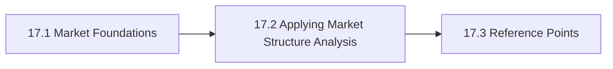

# 17. Vendors Organizations And Market Structure

This chapter is the front door for Vendors Organizations And Market Structure. It examines vendors, organizations, and market structure so sourcing choices reflect concentration, ecosystem dependence, and bargaining power. The chapter is designed to help readers move from orientation into real decisions without losing the atlas priorities around openness, sovereignty, portability, privacy, compliance, and lock-in.

Technical teams often miss that apparently local product choices can widen concentration risk and narrow exit options.

## Chapter Index

- 17.1 [Market Foundations](17-01-00-market-foundations.md)
- 17.1.1 [Actor Types, Power, And Core Distinctions](17-01-01-actor-types-power-and-core-distinctions.md)
- 17.1.2 [Decision Boundaries And Concentration Heuristics](17-01-02-decision-boundaries-and-concentration-heuristics.md)
- 17.2 [Applying Market Structure Analysis](17-02-00-applying-market-structure-analysis.md)
- 17.2.1 [Worked Ecosystem Scenarios](17-02-01-worked-ecosystem-scenarios.md)
- 17.2.2 [Patterns And Anti-Patterns](17-02-02-patterns-and-anti-patterns.md)
- 17.3 [Reference Points](17-03-00-reference-points.md)
- 17.3.1 [Vendors And Projects](17-03-01-vendors-and-projects.md)

## Why This Chapter Exists

The atlas uses chapter front doors as real chapter maps, not as thin navigation stubs. This chapter therefore has to do more than list files. It should explain why the topic matters, show how the chapter is segmented, and help a reader choose the right depth before they disappear into detailed tables or worked examples.

That matters here because vendors organizations and market structure is rarely a self-contained question. Decisions in this chapter usually spill into adjacent chapters about governance, data boundaries, evidence, security, operations, or sourcing. The front door keeps those relationships visible before local optimization starts.

## Chapter Shape

## What This Chapter Helps Decide

- which ecosystem actors matter in a given stack
- where concentration or dependency is becoming material
- how market structure changes the real cost of a technical decision
- which adjacent chapters should be read next because the issue is no longer only about vendors organizations and market structure

## How To Use This Chapter

Start with the first section when the language, scope, or boundary of the topic is still unstable. Move to the second section when the question becomes operational and the team needs practical sequencing, scenarios, or review logic. Use the third section after the conceptual and operating frame is clear enough that named tools, standards, controls, or reference artifacts will sharpen the decision rather than replace it.

If you are reviewing a proposal rather than designing one, use the chapter map to confirm which section the proposal really belongs in. That small check prevents detailed reference material from being mistaken for the whole argument.

## Adjacent Chapters

- Previous: [16. Human Oversight And Operating Model](../16-human-oversight-and-operating-model/16-00-00-human-oversight-and-operating-model.md)
- Next: [18. Build Vs Buy Vs Hybrid](../18-build-vs-buy-vs-hybrid/18-00-00-build-vs-buy-vs-hybrid.md)
- Repository guidance: [Contributing](../../CONTRIBUTING.md), [Editorial Rules](../../EDITORIAL_RULES.md)
