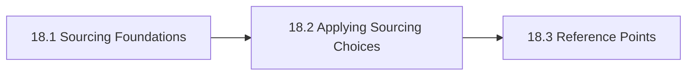

# 18. Build Vs Buy Vs Hybrid

This chapter is the front door for Build Vs Buy Vs Hybrid. It makes build-versus-buy-versus-hybrid a layered sourcing decision rather than a single binary choice. The chapter is designed to help readers move from orientation into real decisions without losing the atlas priorities around openness, sovereignty, portability, privacy, compliance, and lock-in.

Binary build-buy debates obscure the fact that most organizations end up with hybrids and need to manage those deliberately.

## Chapter Index

- 18.1 [Sourcing Foundations](18-01-00-sourcing-foundations.md)
- 18.1.1 [Layered Sourcing, Control, And Core Distinctions](18-01-01-layered-sourcing-control-and-core-distinctions.md)
- 18.1.2 [Decision Boundaries And Sourcing Heuristics](18-01-02-decision-boundaries-and-sourcing-heuristics.md)
- 18.2 [Applying Sourcing Choices](18-02-00-applying-sourcing-choices.md)
- 18.2.1 [Worked Build-Buy-Hybrid Scenarios](18-02-01-worked-build-buy-hybrid-scenarios.md)
- 18.2.2 [Patterns And Anti-Patterns](18-02-02-patterns-and-anti-patterns.md)
- 18.3 [Reference Points](18-03-00-reference-points.md)
- 18.3.1 [Vendors And Projects](18-03-01-vendors-and-projects.md)
- 18.3.2 [Reference Stack Solutions](18-03-02-reference-stack-solutions.md)

## Why This Chapter Exists

The atlas uses chapter front doors as real chapter maps, not as thin navigation stubs. This chapter therefore has to do more than list files. It should explain why the topic matters, show how the chapter is segmented, and help a reader choose the right depth before they disappear into detailed tables or worked examples.

That matters here because build vs buy vs hybrid is rarely a self-contained question. Decisions in this chapter usually spill into adjacent chapters about governance, data boundaries, evidence, security, operations, or sourcing. The front door keeps those relationships visible before local optimization starts.

## Chapter Shape

## What This Chapter Helps Decide

- which layers should be built, bought, or mixed
- where control and differentiation matter enough to own
- when sourcing choices should be revisited as scale or regulation changes
- which adjacent chapters should be read next because the issue is no longer only about build vs buy vs hybrid

## How To Use This Chapter

Start with the first section when the language, scope, or boundary of the topic is still unstable. Move to the second section when the question becomes operational and the team needs practical sequencing, scenarios, or review logic. Use the third section after the conceptual and operating frame is clear enough that named tools, standards, controls, or reference artifacts will sharpen the decision rather than replace it.

If you are reviewing a proposal rather than designing one, use the chapter map to confirm which section the proposal really belongs in. That small check prevents detailed reference material from being mistaken for the whole argument.

## Adjacent Chapters

- Previous: [17. Vendors Organizations And Market Structure](../17-vendors-organizations-and-market-structure/17-00-00-vendors-organizations-and-market-structure.md)
- Next: [19. Reference Architectures](../19-reference-architectures/19-00-00-reference-architectures.md)
- Repository guidance: [Contributing](../../CONTRIBUTING.md), [Editorial Rules](../../EDITORIAL_RULES.md)
