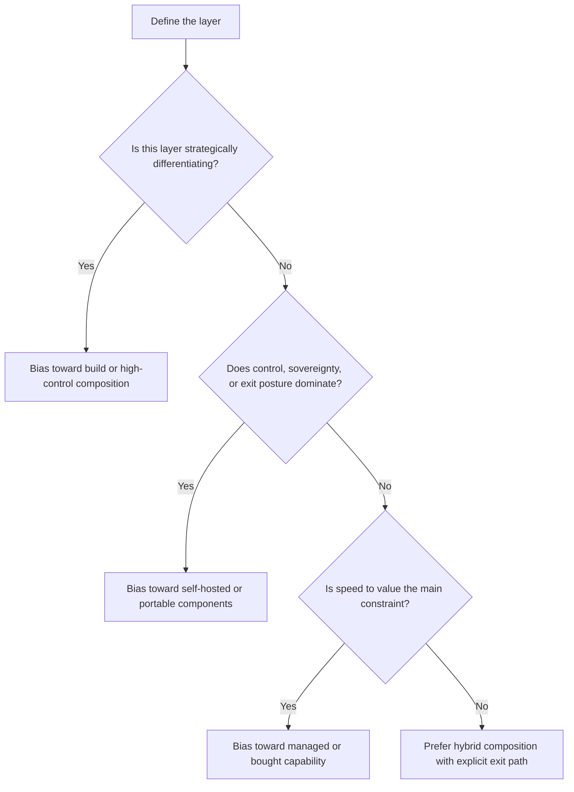

# 18.1.3 Build Buy And Hosting Decision Tree

_Page Type: Decision Guide | Maturity: Review-Ready_

Use this guide to split sourcing decisions by layer and by hosting posture. The question is rarely only “build or buy”; it is usually “what should we own, what should we rent, and where must control stay local?”

## Decision Tree

## Layered Defaults

| Layer | Default sourcing bias | Escalate to higher control when... |
| --- | --- | --- |
| Commodity model access | Buy | Data boundary, latency, or sovereignty risk becomes first-order |
| Retrieval and permissions | Hybrid | The knowledge layer holds sensitive or organization-specific control logic |
| Workflow and policy logic | Build or compose | The process itself creates differentiation or audit burden |
| Evaluation and observability | Build around portable tools | Evidence must remain exportable across providers |
| End-user productivity suite features | Buy | The suite begins to absorb too much operational data or workflow ownership |

## Review Prompts

- Which dependency would be hardest to replace in practice: the model, the data plane, the workflow engine, or the accumulated operating knowledge?
- If the vendor contract ended in twelve months, what would be hardest to recreate?
- Which layer must remain portable even if another layer is deliberately bought for speed?

Back to [18.1 Sourcing Foundations](18-01-00-sourcing-foundations.md).
