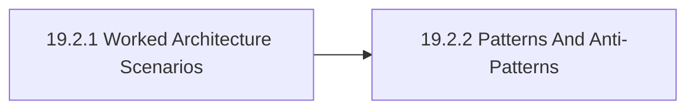

# 19.2 Applying Reference Architectures

This section turns the chapter into delivery and review guidance for Reference Architectures. Within the chapter, it turns the atlas into reusable architecture shapes so teams can compare reference patterns without pretending one stack fits every system, but the emphasis here is narrower: this section turns the chapter into delivery, review, and operating work so the concepts are checked against real organizational situations.

## Section Map

- 19.2.1 [Worked Architecture Scenarios](19-02-01-worked-architecture-scenarios.md)
- 19.2.2 [Patterns And Anti-Patterns](19-02-02-patterns-and-anti-patterns.md)

This guide turns the chapter into a delivery and operating sequence. It is intentionally practical: what to check first, what to defer, and what should trigger review before wider rollout.

## Why This Section Exists

This section turns the chapter into delivery, review, and operating work so the concepts are checked against real organizational situations. It gives readers a stable place to answer the questions that are most likely to be confused inside reference architectures, which makes later comparison more reliable because it rests on a shared frame instead of local shorthand.

This section should also be read as part of the atlas mission rather than as a self-contained mini-essay. The point is to surface how applying reference architectures changes control, portability, sovereignty, privacy, compliance, and operating burden in real organizational systems.

## Section Shape

## What To Look For Here

- the recommended sequence for applying the chapter in practice
- the failure modes and re-review triggers that should not be hidden
- the places where adjacent chapters must be pulled back into the decision
- where the section should hand the reader off to adjacent chapters instead of trying to answer everything locally

## Reading Guidance

Use this section when the chapter language is already accepted but the team still needs help sequencing work, exposing failure modes, or setting review gates. When in doubt, ask whether the material here changes a real decision, review, or operating posture. If it does not, go back up one level and confirm that the right chapter or section is being used.

## Review Prompts

- Does the proposed sequence expose ownership, review gates, and rollback triggers clearly enough?
- Are adjacent dependencies explicit rather than implied?
- Would the chapter still help if the use case were higher consequence or broader in scope?

Back to [19. Reference Architectures](19-00-00-reference-architectures.md).
