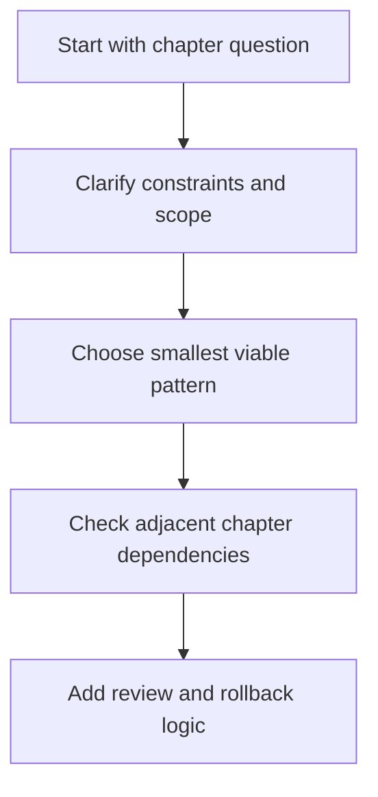

# 19.2.2 Patterns And Anti-Patterns

_Page Type: Reference Sheet | Maturity: Outline_

This subsection captures reusable good shapes and recurring failure shapes so the chapter remains useful during design review as well as implementation.

This file captures reusable ways to think about the topic. The point is not to add more categories. The point is to help readers recognize good and bad shapes quickly.

## Patterns To Reuse

- Reference architectures are reusable shapes, not turnkey blueprints
- Fit depends on risk, control needs, and operating maturity
- Patterns should remain smaller than the full possibility space

## Anti-Patterns To Avoid

- Using the chapter as only a taxonomy layer and never translating it into decisions.
- Keeping comparison tables without explanatory narrative around them.
- Letting local terminology drift away from the canonical chapter language.

## Decision Flow

## Review Prompt

| During review ask... | Why |
| --- | --- |
| Are the chapter distinctions still visible in the proposal? | Prevents local shortcuts from flattening important trade-offs |
| Are openness, sovereignty, privacy, compliance, and lock-in visible where they matter? | Keeps the chapter aligned with the atlas mission |
| Has the team translated the pattern language into an actual design or control decision? | Prevents the section from remaining only descriptive |

Back to [19.2 Applying Reference Architectures](19-02-00-applying-reference-architectures.md).
