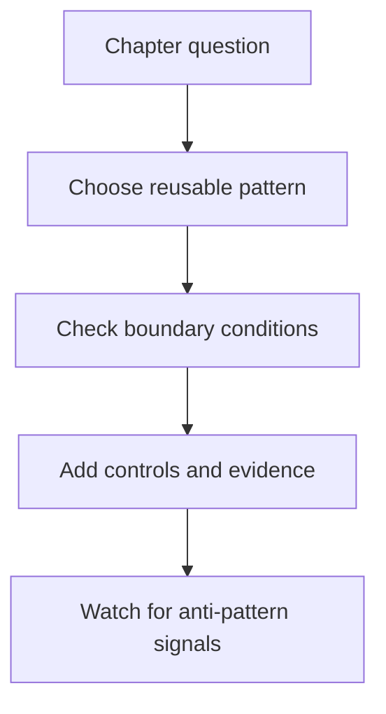

# 21.2.2 Patterns And Anti-Patterns

_Page Type: Reference Sheet | Maturity: Draft_

This subsection captures reusable good shapes and recurring failure shapes so the chapter remains useful during design review as well as implementation.

Patterns matter here because research open knowledge and community is easy to discuss in the abstract but much harder to operationalize consistently. Reusable patterns compress judgment: they show teams what a good shape looks like before local naming, tooling, or organizational politics make the design harder to evaluate.

## Why Pattern Language Helps

The goal is not to create slogans. The goal is to make recurring good and bad shapes visible early enough that teams can course-correct before they invest in the wrong architecture, control model, or operating process.

## Decision Flow

This file captures reusable ways to think about the topic. The point is not to add more categories. The point is to help readers recognize good and bad shapes quickly.

## Patterns To Reuse

- Public knowledge is fragmented and must be read selectively
- Open-source documentation is often the fastest route to implementation detail
- Neutral public guidance is valuable but often higher level

## Anti-Patterns To Avoid

- Using the chapter as only a taxonomy layer and never translating it into decisions.
- Keeping comparison tables without explanatory narrative around them.
- Letting local terminology drift away from the canonical chapter language.

## Review Prompt

| During review ask... | Why |
| --- | --- |
| Are the chapter distinctions still visible in the proposal? | Prevents local shortcuts from flattening important trade-offs |
| Are openness, sovereignty, privacy, compliance, and lock-in visible where they matter? | Keeps the chapter aligned with the atlas mission |
| Has the team translated the pattern language into an actual design or control decision? | Prevents the section from remaining only descriptive |

## Review Signals

- The reusable pattern should still expose ownership, evidence, and rollback logic.
- The anti-pattern should describe a real failure shape, not just a stylistic preference.
- The chapter's cross-cutting priorities should remain visible even when the local implementation looks convenient.

## Practical Reading Rule

Use these patterns to stress-test a proposal after the concepts are clear and before the design is treated as settled. If a team cannot explain why its approach avoids the anti-patterns listed here, the review is not finished.

Back to [21.2 Applying Open Knowledge](21-02-00-applying-open-knowledge.md).
